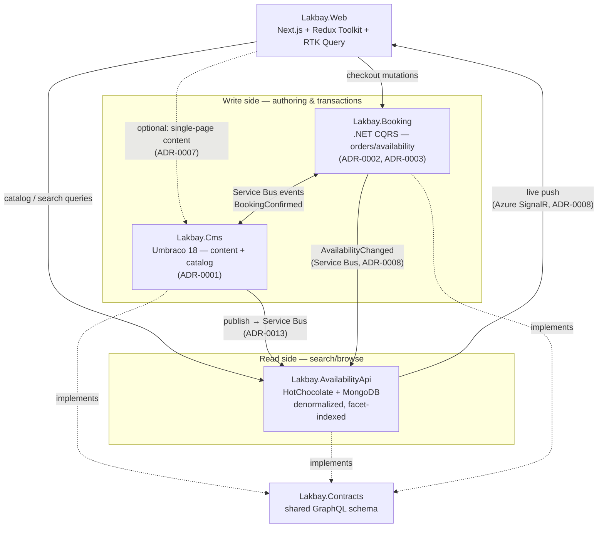

# System Architecture — Per-Repo and Whole-Platform

Lakbay is a multi-application integration, not a monolith — six repos,
four of them running services. This document is the single place that
answers "what is each piece's internal shape, and how do the pieces
actually fit together" — the prose companion to the
[Lakbay System Map](https://claude.ai/code/artifact/6779ad3c-7fdd-416b-9a32-01fe8100606d)
diagram and to the individual ADRs, which explain *why* each seam is
where it is. This document explains *what the shape is*, end to end.

## The whole-platform shape, in one sentence

Content and product data are **authored** in one place
(`Lakbay.Cms`), **searched/browsed** through a different, purpose-built
place (`Lakbay.AvailabilityApi`), **transacted** in a third, deliberately
isolated place (`Lakbay.Booking`), and **presented** entirely by a fourth
(`Lakbay.Web`) — connected by one shared contract
(`Lakbay.Contracts`) and event-driven sync, not by services reaching into
each other's databases.

This is a **CQRS split applied at the scale of the whole platform**, not
just inside one repo: `Lakbay.Cms` is the write/authoring side for
content and catalog data; `Lakbay.AvailabilityApi` is a dedicated, denormalized
read side optimized for the query pattern shoppers actually run
(destination + theme + price + date, faceted). `Lakbay.Booking` applies
the same read/write separation *internally*, one level down, via MediatR
(ADR-0002). Recognizing this as one repeated pattern, not three unrelated
decisions, is the point of this document.

## Why this shape, not a monolith or a hand-off chain

Three real constraints drove the split, each documented as its own ADR —
this section is the synthesis, not a replacement for reading them:

1. **Read-heavy publishing vs. write-heavy transactions have different
   performance profiles.** Umbraco's NuCache is built for read-heavy,
   publish-then-cache workloads. Order/basket writes are the opposite.
   Mixing them risks lock contention on the CMS at exactly the moment
   (checkout) it matters most. (ADR-0001, ADR-0003)
2. **General-purpose content indexing and purpose-built faceted search
   are different tools.** Hotelplan's own history (`api-sphinx`, backed
   by Manticore) shows this directly — a dedicated search service handled
   filtered product search precisely because a CMS's own content index
   wasn't the right tool for it at scale. (ADR-0007)
3. **A frontend that depends on a CMS's rendering pipeline can't be built
   or tested independently of it.** Headless-everything (ADR-0006) plus a
   shared, versioned contract (`Lakbay.Contracts`) means `Lakbay.Web` can
   be built, tested, and even demoed against `Lakbay.AvailabilityApi` alone —
   no other service needs to be running.

The cost of this shape is real and worth naming, not hand-waved: four
services to deploy and operate instead of one, a sync mechanism to build
and keep correct (`Lakbay.Cms` → `Lakbay.AvailabilityApi`), and eventual (not
transactional) consistency between authoring and search results. For a
small team, that cost is accepted because the alternative — one service
trying to be good at authoring, search, and transactions at once — is the
shape that produces the exact kind of contention and coupling these ADRs
exist to avoid.

## Real-time availability: closing a gap Inghams/Hotelplan had

A named, deliberate improvement over the precedent: when
`Lakbay.Booking` confirms a booking and a listing sells out, that has to
reach anyone currently looking at it — not wait for their next refresh.
Three hops, using infrastructure already in the stack rather than adding
a new mechanism (full reasoning: [ADR-0008](adr/ADR-0008-realtime-availability-propagation.md)):

1. `Lakbay.Booking` publishes `AvailabilityChanged` on Service Bus the
   moment a booking is confirmed.
2. `Lakbay.AvailabilityApi` consumes it and updates its own MongoDB read model
   immediately — the same "keep the read model current" job it already
   does for `Lakbay.Cms` publishes, applied to a second event source.
3. `Lakbay.AvailabilityApi` pushes a small "this listing changed" notification
   over Azure SignalR Service; `Lakbay.Web` invalidates just that one
   item's RTK Query cache entry and re-fetches it — no page reload, no
   polling.

This is deliberately **not** the same thing as preventing overselling.
Two shoppers racing for the last slot is a concurrency-control problem
inside `Lakbay.Booking`'s own confirm-booking handler, unaffected by how
fast the UI elsewhere updates — see ADR-0008's context section for why
these are kept as two separate concerns.

## Per-repo architecture

### Lakbay.Cms — authoring & source of truth

| | |
|---|---|
| **Owns** | Editorial content, the product catalog (holidays, itineraries, pricing bands, media) |
| **Does not own** | Orders, baskets, live availability (ADR-0003); public-facing page rendering (ADR-0006) |
| **Stack** | Umbraco 18 on .NET |
| **Exposes** | Umbraco Content Delivery API + a GraphQL layer matching `Lakbay.Contracts` |
| **Consumes** | Nothing from the other services at runtime — it's the source of truth, not a consumer |
| **Publishes** | A `CatalogSyncEvent` to Azure Service Bus (`lakbay-catalog-sync` queue, ADR-0013) on every Products-tree publish, consumed by `Lakbay.AvailabilityApi.Sync`; Service Bus events consumed by `Lakbay.Booking` where availability affects catalog display |

Internal shape: business rules that govern *what a valid product record
is* (required fields, price-band consistency, itinerary validation) live
behind a `IProductCatalogRepository`-shaped abstraction (Repository
pattern, per `03_ARCHITECTURE_AND_PATTERNS_GUIDE.md`) so they're testable
without a live Umbraco instance — not scattered across Razor-less
controller/GraphQL-resolver code that talks to Umbraco's APIs directly.

### Lakbay.Booking — transactions, isolated on purpose

| | |
|---|---|
| **Owns** | Orders, baskets, the availability calendar, payment orchestration |
| **Does not own** | Content or catalog data — reads product identity/pricing via `Lakbay.AvailabilityApi` or `Lakbay.Cms`, never its own copy |
| **Stack** | .NET minimal API, own Azure SQL database |
| **Exposes** | CQRS command/query handlers (ADR-0002) behind an API surface `Lakbay.Web`'s checkout flow calls |
| **Consumes** | Product/pricing data (read path TBD in Phase 4 — likely `Lakbay.AvailabilityApi`, since that's the already-fast read path); PayMongo (external, checkout) |
| **Publishes** | `BookingConfirmed`, `AvailabilityChanged` over Service Bus — `AvailabilityChanged` is consumed by `Lakbay.AvailabilityApi` to keep listings live (ADR-0008) and by `Lakbay.Cms` if availability affects catalog display |

Internal shape: Commands and Queries as separate MediatR handlers (ADR-0002),
`IPaymentGateway`/`INotificationChannel` as Strategy-pattern interfaces so
PayMongo (and later Stripe) or Email/SMS channels are swappable without
touching calling code, domain events (not inline calls) for side effects
of a confirmed booking. **`ConfirmBookingCommandHandler` decrements
availability with a single atomic, conditional SQL `UPDATE`** — never a
separate read-then-write check — so two near-simultaneous bookings for
the same slot cannot both succeed; this is what actually prevents
double-booking, independent of anything `Lakbay.AvailabilityApi` does
(ADR-0011).

### Lakbay.AvailabilityApi — the read model, permanent (ADR-0007)

| | |
|---|---|
| **Owns** | A denormalized, facet-indexed copy of the catalog — its own MongoDB, not shared with any other repo |
| **Does not own** | Authoring (that's `Lakbay.Cms`'s job — this repo is a consumer of sync data, never a source of edits) |
| **Stack** | ASP.NET Core + HotChocolate + MongoDB.Driver |
| **Exposes** | GraphQL queries matching `Lakbay.Contracts`, with real faceted filtering (destination, theme, price, date) as the reason this repo exists |
| **Consumes** | Sync signal from `Lakbay.Cms` on publish (content/catalog changes); `AvailabilityChanged` events from `Lakbay.Booking` (ADR-0008) |
| **Publishes** | Real-time change notifications to Azure SignalR Service when its read model updates (ADR-0008) — the only repo that pushes to connected browsers |

Internal shape: **two deployables, one repo (ADR-0009).** The GraphQL
query API is a thin resolver layer over `MongoDB.Driver` queries
(`HotChocolate.Data.MongoDb`) and does nothing else — no Service Bus
awareness at all, so query performance is never affected by sync/write
load. `Lakbay.AvailabilityApi.Sync`, a separate Azure Function
(`[ServiceBusTrigger]`), owns both Service Bus subscriptions
(Cms-publish-sync, Booking-availability-sync), applies each update with a
last-write-wins timestamp guard (ADR-0010) via an atomic
`findOneAndUpdate`, and fires the SignalR notification afterward.
Deliberately does not duplicate `Lakbay.Cms`'s business-rule validation —
by the time data reaches this repo, it's already been validated at the
source. The Function is the single place that both applies read-model
changes *and* tells the browser when they happen — deliberately not split
further (see ADR-0008's alternatives).

### Lakbay.Web — all presentation, all of it (ADR-0006)

| | |
|---|---|
| **Owns** | Every pixel of UI — layout, templates, routing, SEO rendering |
| **Does not own** | Any data — no database, no direct SQL/Mongo access, ever |
| **Stack** | Next.js (App Router), Redux Toolkit + RTK Query, TypeScript |
| **Exposes** | The public site itself |
| **Consumes** | `Lakbay.AvailabilityApi` (catalog/search — the default path for anything product-related), `Lakbay.Booking` (checkout mutations), optionally `Lakbay.Cms` directly for single-page, non-search content (ADR-0007); Azure SignalR Service push notifications from `Lakbay.AvailabilityApi` while a listing page is open (ADR-0008) |
| **Publishes** | Nothing at the service level |

Internal shape: RTK Query API slices per backend (`availabilityApi`,
`bookingApi`) generated against `Lakbay.Contracts`' types; plain Redux
Toolkit slices reserved for state with no server source of truth (booking
wizard step, basket UI, active filters) — never used as a cache for
server data RTK Query already owns. **A block registry** (a
`Record<elementTypeAlias, ReactComponent>` map) renders `Lakbay.Cms`'s
Block List/Block Grid JSON — the mechanism for arranging CMS-authored
page content without any Razor involved (ADR-0012).

### Lakbay.Contracts — the seam itself

| | |
|---|---|
| **Owns** | The GraphQL SDL schema and generated TS/C# types — nothing else |
| **Does not own** | Any runtime behavior — never a running service |
| **Consumed by** | `Lakbay.Cms`, `Lakbay.Booking`, `Lakbay.AvailabilityApi` (C# types, schema implementation), `Lakbay.Web` (TS types) |

This repo is what makes the CQRS-at-platform-scale shape above safe: every
implementer of the schema (`Lakbay.Cms`, `Lakbay.AvailabilityApi`) is checked
against the same SDL in CI, so `Lakbay.Web` can be pointed at either
without knowing which one is answering.

### Lakbay.Docs — not a service

Platform plan, this document, ADRs, devlog. No runtime role. Exists so the
"why" above has one home instead of five partial copies.

## Deployment topology (Phase 5 target)

Four runtime services (`Lakbay.Cms`, `Lakbay.Booking`, `Lakbay.Web`,
`Lakbay.AvailabilityApi`) deploy to Azure Container Apps, plus
`Lakbay.AvailabilityApi.Sync` as an Azure Function (ADR-0009) — a fifth
deployable, but not a fifth repo. `Lakbay.Cms` and
`Lakbay.Booking` each get their own Azure SQL Database (ADR-0003, local
dev via SQL Server in Docker per ADR-0005). `Lakbay.AvailabilityApi`'s MongoDB
runs as a managed instance (Azure Cosmos DB for MongoDB, or MongoDB
Atlas — an open choice for Phase 5). Azure Service Bus carries
cross-service events; Azure Cache for Redis, Azure SignalR Service, and
Microsoft Entra External ID sit around the edges as shared infrastructure,
not owned by any single repo. See the Lakbay Blueprint's technology-stack
table for the full per-service Azure verdicts.

## Where this document fits

- **This file** — what each piece is and how they connect, structurally.
- **`03_ARCHITECTURE_AND_PATTERNS_GUIDE.md`** — internal code-level
  patterns (OOP/SOLID/design patterns) each repo follows.
- **`08_LOCAL_INFRASTRUCTURE.md`** — the same connections above, but from
  "what's actually running in Docker on my machine" instead of the
  conceptual/deployment view.
- **`09_FEATURE_MAP.md`** — a fast index from a feature or bug report
  straight to the file/class responsible, across all repos.
- **`docs/adr/`** — why each structural seam is where it is, with
  alternatives considered.
- **The Lakbay System Map artifact** — the visual version of the read/write
  split above; keep it in sync with this file if either changes.
